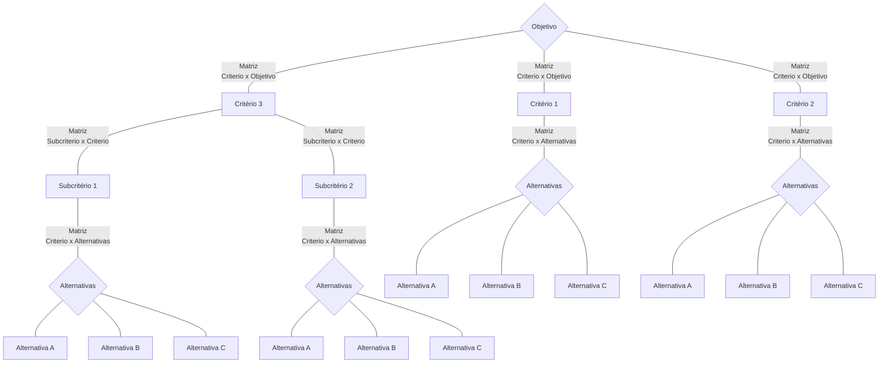

## Práticas e estudos com AHP

- Analisando métodos: analisei cada método utilizado para obter os valores do autovetor

- Cálculo dos índices de concistência

### Construção de hierarquia

Decompor o problema de decisão em critérios e subcritérios, para o objetivo inicial separamos os critérios  que serão relacionados a cada alternativa e dentro destes podemos apresentar mais camadas de subcritérios.

As alternativas terão uma matriz de comparação relativa a cada critério/subcritério e estes por sua vez terão uma matriz de comparação entre si relativas ao objetovivo principal ( no caso do subcritérios teram uma matriz de comparação entre si relativos a um critério )

